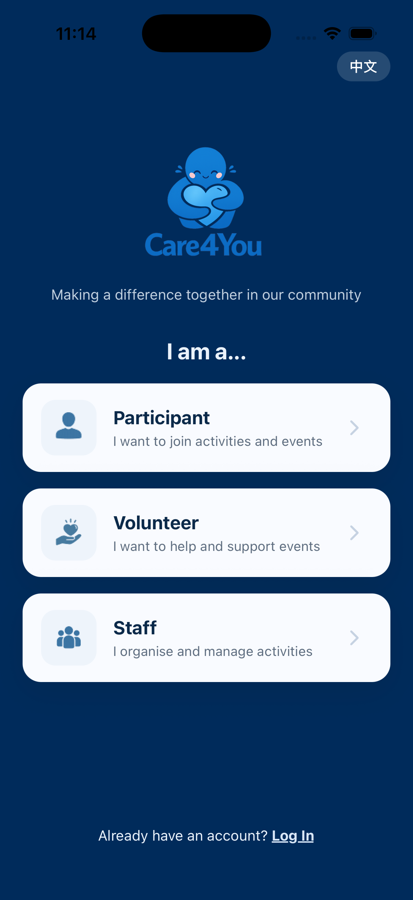
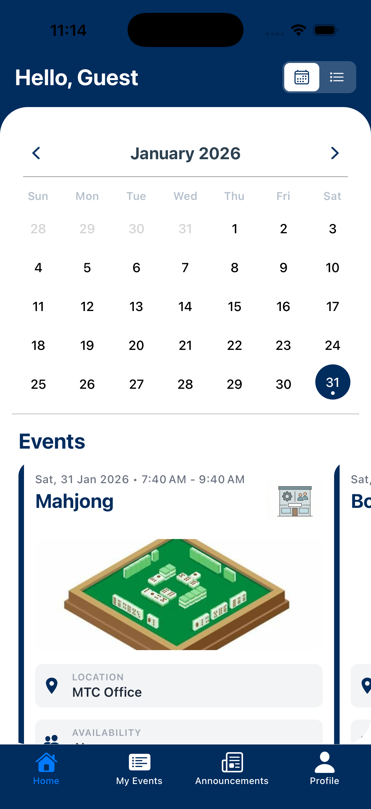

# Care4You | Hack4Good 2026 | Team: Hack4Fun</h1>

**Care4You** is a community-driven platform built to bridge the gap between volunteers, participants, and impactful social events. Designed for the **Hack4Good** hackathon, this mobile application streamlines event discovery and registration with a seamless "Virtual Guest" system for immediate engagement.

---

<br>

<table align="center">
  <tr>
    <td></td>
    <td></td>
  </tr>
</table>

### ⚠️ The Problem

**Problem Statement: "How might we reduce friction in activity sign-ups for both individuals and caregivers, while reducing manual effort for staff in managing and consolidating registration data?"**

- 👵 Elderly users often struggle with account creation before taking action
- 🧑‍⚕️ Caregivers need fast, low-friction registration without technical barriers
- 🧑‍💼 Staff face fragmented registration data and time-consuming manual consolidation

---

### 💡 Our Solution: Frictionless Participation & Management

Care4You reduces friction at both the user and staff level by removing unnecessary steps at the point of action, while ensuring data remains structured and manageable.

### 🔑 Core Principle

Lower the barrier to act — without increasing backend complexity.

---

### 🧩 Solution Breakdown by User Group

#### 👤 For Participants & Caregivers

Reduce friction at the point of action

- ⚡ Instant Guest Registration
  - Users can browse and register for activities without creating an account
  - Ideal for elderly users and first-time users

- 📅 Calendar & List View
  - Browse activities in a monthly calendar view or a scrollable list view
  - Clear, accessible overview of upcoming activities

- 🔄 Automatic Account Conversion
  - When a guest signs up or logs in, all previously registered activities are seamlessly transferred
  - No re-registration, no confusion

- 🔔 Waitlist with Auto-Promotion
  - When an event is full, users are placed on a waitlist automatically
  - If a confirmed participant pulls out, the next person on the waitlist is promoted into the event — no action needed from the user

- 🌐 LLM-Powered Translation
  - All event details created by staff are automatically translated using an LLM
  - Users can toggle between English and Chinese to view events in their preferred language

- 📢 Announcements
  - Receive real-time updates and notices from staff directly in the app
  - Stay informed on event changes, slot openings, and community news

Impact:<br>
Lower drop-off rates, higher participation, and a more inclusive experience for elderly users.

#### 🧑‍💼 For Staff & Organisers

Reduce manual work and data fragmentation

- 📝 Centralised Event Management
  - Create and manage events from a single platform

- 📊 Unified Registration Tracking
  - Guest and registered users are consolidated automatically

- 📤 CSV Export
  - One-click export of clean, structured registration data
  - Eliminates manual merging from multiple sign-up channels

- ⏱️ Real-Time Insights
  - Track participant and volunteer slots accurately

- 📱 QR Code Attendance Tracking
  - Generate time-stamped QR codes for each event
  - Scan to check in participants on the spot — replaces manual pen-and-paper attendance
  - Attendance counts are tracked separately for participants and volunteers

- 📢 Targeted Announcement Channels
  - Choose to broadcast announcements to everyone or only to people registered in a specific event
  - One post reaches the right audience — no more repeating messages across multiple channels

- 🌐 Automatic Event Translation
  - Staff create events once in one language; the system uses an LLM to translate all details automatically
  - Translation results are cached for performance

Impact:<br>
Less administrative overhead, cleaner data, and more time spent on community impact instead of paperwork.

### 🧠 Why This Matters

Instead of forcing users to adapt to the system, Care4You adapts to user behaviour, while still giving staff clean, actionable data.

---

### 🚀 Getting Started

### Option 1: Android Users (Easiest for Android)

If you have an Android device, you can install the app directly via our APK file.

1. **Download the APK:** [CLICK HERE TO DOWNLOAD ANDROID APK](https://expo.dev/accounts/jayyy25/projects/hack4fun/builds/dc6300ec-6540-466c-9ce6-4ca6ad6c1eb9)
2. **Install:** Open the file on your phone.
   - _Note:_ You may need to allow "Install from Unknown Sources" in your settings if prompted.
3. **Run:** Open the "Care4You" app from your app drawer.

---

### Option 2: iOS Users (Requires Mac & Xcode)

Since this is a prototype build, it runs on the **iOS Simulator** (part of Xcode) rather than a physical iPhone.

**Prerequisites:**

- A Mac computer
- Xcode installed (Free on the App Store)

**Steps:**

1. Open **Xcode** on your Mac.
2. Go to the top menu bar: **Xcode** > **Open Developer Tool** > **Simulator**. Wait for the virtual iPhone to boot up.
3. **Download the iOS Build:** [CLICK HERE TO DOWNLOAD .APP ZIP](https://expo.dev/accounts/jayyy25/projects/hack4fun/builds/2ef08418-5c39-4e10-a597-da0898d8f50c)
4. Unzip the file to reveal `hack4fun.app` (or similar).
5. **Drag and Drop** the `.app` file directly onto the virtual iPhone screen in the Simulator.
6. The app icon will appear on the home screen. Tap it to launch!

---

### Option 3: For Developers (Run from Source)

If you want to modify the code or run the development version on your own setup.

**Prerequisites:**

- Node.js installed
- Expo Go app installed on your physical phone (optional)

**Steps:**

1. **Clone the repository:**
   ```bash
   git clone https://github.com/Hack4Funnn/care4you.git
   ```
2. **Navigate to frontend directory:**
   ```bash
   cd frontend
   ```
3. **Install dependencies:**
   ```bash
   npm install
   ```
4. **Start the app:**
   ```bash
   npx expo start
   ```
5. **Scan & Run:**

- Scan the QR code with the Expo Go app (Android)
- Or press `a` to run on Android Emulator / `i` to run on iOS Simulator / `w` to run on local webpage

---

### ✨ Key Features

- Virtual Guest System: Users can browse and register for events immediately without an account. A unique guest\_ ID is generated locally to track their activity.
- The Conversion Deal: When a guest eventually signs up or logs in, all their previous event registrations are automatically migrated to their new permanent account.
- Dynamic Event Registration: Real-time slot tracking for both volunteers and participants, ensuring event organizers have accurate data.
- Role-Based Access: Specific workflows for Volunteers and Participants to ensure everyone finds the right way to help.

---

### 🛠️ Tech Stack & Structure

### Technologies

| Layer        | Technology                                                     |
| :----------- | :------------------------------------------------------------- |
| **Frontend** | React Native, Expo (Expo Go), Expo Router, TypeScript, i18next |
| **Backend**  | Node.js, Express (Hosted on Google Cloud)                      |
| **Database** | PostgreSQL (Supabase)                                          |
| **AI**       | OpenAI API (LLM-powered event translation)                     |
| **Storage**  | AsyncStorage for local session persistence                     |

### Project Directory

```text
├── frontend/             # Mobile Application (Focus of UI/UX)
│   ├── app/              # File-based routing (Expo Router)
│   ├── services/         # API & Auth Logic (Conversion Deal)
│   └── components/       # Reusable UI Elements
└── backend/              # SQL-based API Logic
    ├── models/           # Data migration & logic
    └── controllers/      # Auth & Registration management
```

---

### 👥 The Team

- **Team Name:** BTS CS
- **Team Lead:** Yi Jie Chong
- **Developer:** Tan Jay, Tey Yee Siang

---
